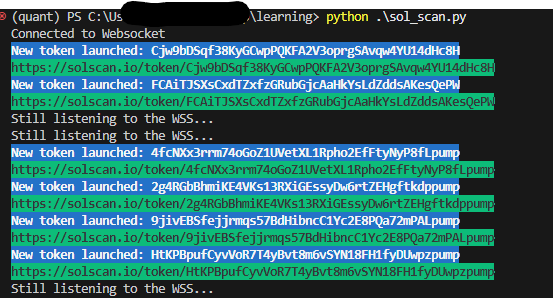

# PumpFun New Token Launch Scanner

**Python 3.8.20**

This script scans for new token launches on the PumpFun platform in real-time.

## Features

*   Listens to Solana blockchain events.
*   Identifies new PumpFun token launches as they occur.
*   Provides alerts for each new token, including relevant links (SolScan, DexScreener, Birdeye).
*   Saves the detected token launches to a CSV file (`sol_scan.csv`) for future reference.

## Setup

1.  **Install required libraries:**

    ```bash
    pip install aiohttp websockets termcolor
    ```

2.  **Run the script:**

    ```bash
    python sol_scan.py
    ```

## Usage

1.  Make sure you have Python 3.8.20 installed.
2.  Clone this repository.
3.  Run the script (`python sol_scan.py`).

The script will connect to the Solana blockchain and start monitoring for new PumpFun token launches.

**Note:** For more accurate, smooth results and improved performance, using a paid RPC service like QuickNode is recommended instead of the Solana mainnet public RPC.

## Screenshot



